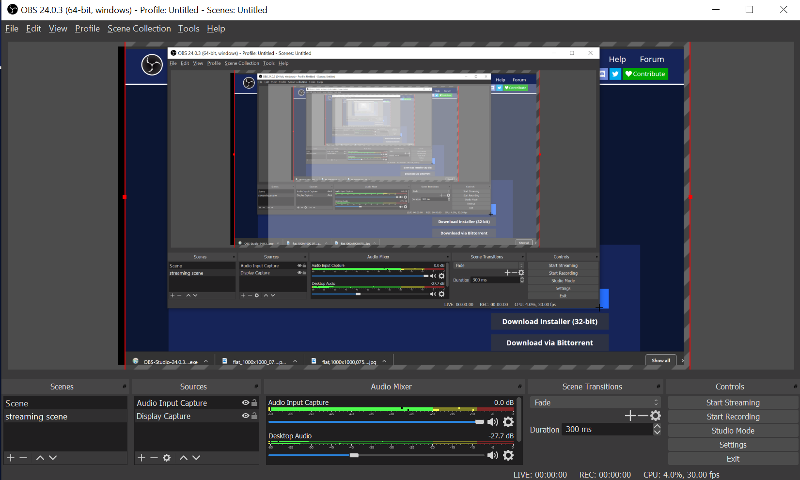
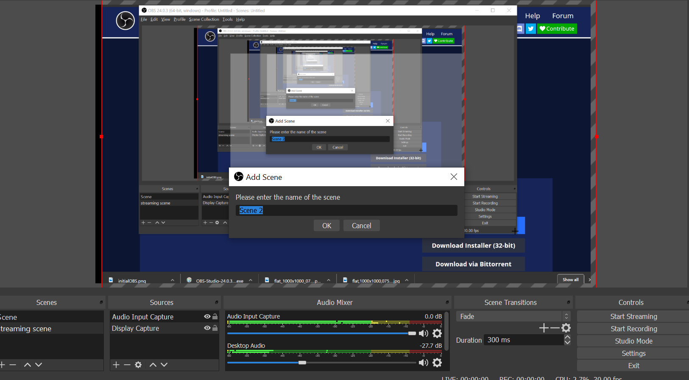
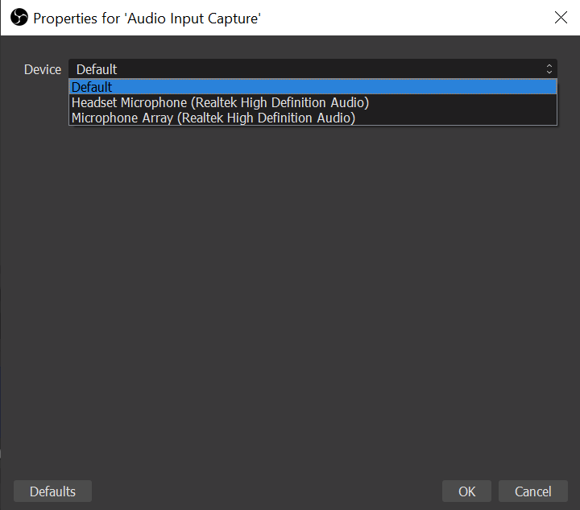
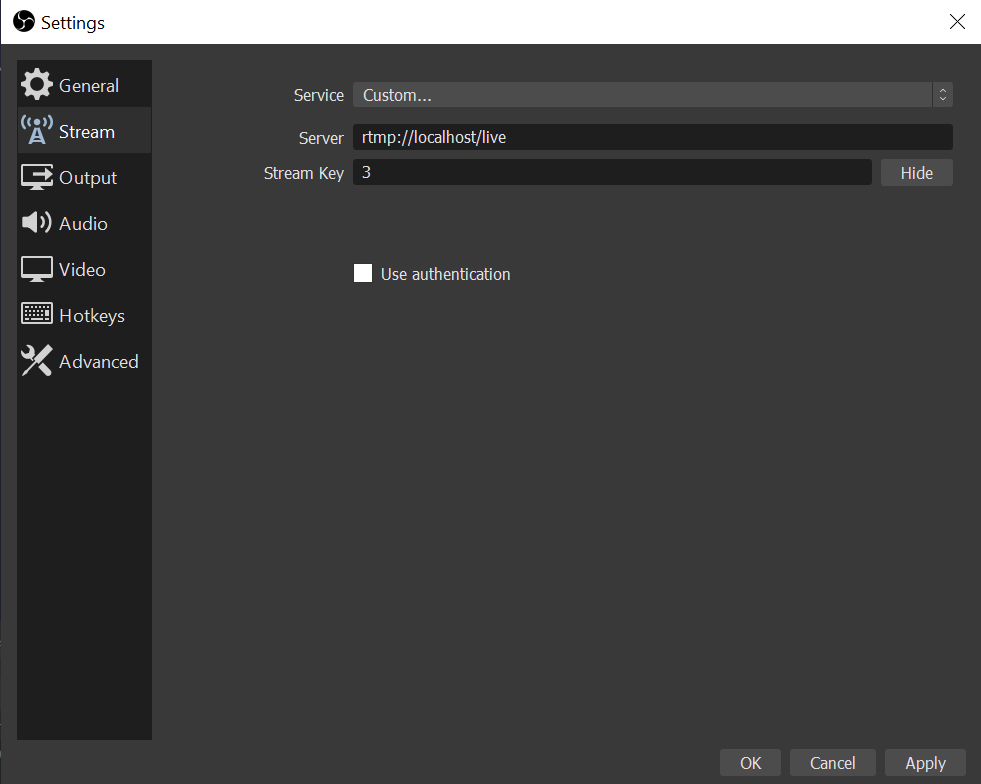

# Twitch.tv replica

This app was built because I enjoy watching streams on [Twitch](https://twitch.tv). Utilizes CRUD with react/redux to pass data through components and the server. Requires OBS downloaded to stream through this app.

## How to get set up

<ul>
    <li>clone the repo</li>
    <li>npm install in the main folder, 'api', and 'rtmpserver'</li>
    <li>Go to the [OBS website](https://obsproject.com/download) and download the installer for your OS</li>
    <li>Once you get through the installation you should see something simlar to this image</li>
</ul>

<ul>
    <li>click on the '+' in the Scenes box and enter any scene name</li>
    <li>click on the '+' in the Audio box and click on the audio device you will be using to capture for your stream</li>
</ul>

 

<ul>
    <li>click on settings on the bottom left of the screen and click on the stream box on the left</li>
    <li>select a custom service and type out the exact same input thats in the 'Server' input</li>
    <li>the 'Stream Key' will be whatever stream id that is generated when you created a stream. It will be found in the URL</li>
    <li>Click the 'Start Streaming' button on the bottom left and you will be ready to go!</li>
</ul>

## Roadmap

Work needs to be done on the styling of the app. Also on backend security so anyone can stream on anyones stream as long as they have the ID